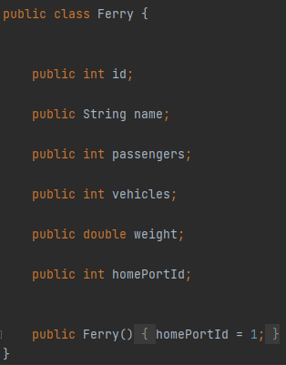
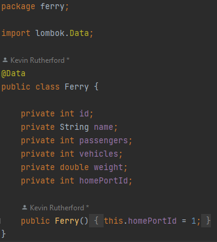
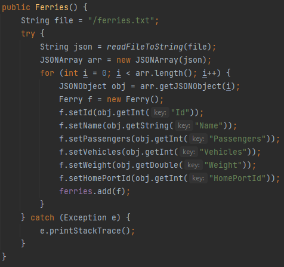

# Sistema de Reserva de Ferry

## Descripción General

El Sistema de Reserva de Ferry es una aplicación Java simple diseñada para gestionar reservas de ferry. Incluye clases para manejar información de ferry, cruces disponibles y reservas. 
El sistema lee datos de ferry desde un archivo JSON y permite a los usuarios ver cruces disponibles y realizar reservas.

## Code Smells y Sugerencias de Refactorización

Este proyecto fue analizado para identificar code smells y oportunidades de refactorización. Las siguientes secciones detallan los problemas identificados y las mejoras sugeridas.
Antes de verificar clase por clase, modificaremos la estructura de paquetes para que el código sea más legible y fácil de mantener.

### Estructura de Paquetes

La estructura de paquetes actual es plana y no proporciona una separación clara de responsabilidades.

Se sugiere reorganizar el código en paquetes más pequeños y enfocados, como se muestra a continuación (esto lo hacemos al inicio para identificar cada módulo,
sin embargo, si en el proceso vemos necesario volver a reorganizar los paquetes, por ejemplo, para señalar las clases controladoras y de servicios, lo haremos después):

---
## Ferry

### Clase Ferry

#### Code Smells

1. **Uso de Variables Públicas:** Las variables dentro de la clase `Ferry` son públicas, lo que puede llevar a problemas de seguridad y encapsulación.

#### Sugerencias de Refactorización

1. **Encapsulación:** Cambiar las variables a privadas y proporcionar métodos getter y setter para acceder y modificar los valores. Para ello, usaremos la
anotación @Data de Lombok, que nos permite generar automáticamente los métodos getter y setter, además de los métodos equals, hashCode y toString.
Como este proyecto es de años anteriores, debemos actualizar el archivo build.gradle para que sea funcional y se importen las dependencias necesarias.

Una vez que se ha actualizado el archivo build.gradle, se ejecuta el comando `gradle build` para que se descarguen las dependencias y se construya el proyecto.

- Debemos cambiar el llamado de las variables en otras clases, ya que antes eran públicas y ahora son privadas.

### Clase Ferries

#### Code Smells

1. **Manejo de Excepciones para Control de Flujo:** El constructor de la clase `Ferries` utiliza excepciones para controlar el flujo de la aplicación. Esta no es una práctica recomendada.

2. **Múltiples Responsabilidades en el Constructor:** El constructor de `Ferries` es responsable de leer un archivo, parsear JSON y crear objetos `Ferry`. 
Esto viola el Principio de Responsabilidad Única de SOLID.

#### Sugerencias de Refactorización

1. **Extraer Método:** Extraer el código responsable de leer el archivo y parsear JSON en un método separado. Esto hará que el constructor sea más limpio y enfocado en su responsabilidad principal.

2. **Violación de Single Responsibility:** Dividir el constructor en métodos más pequeños, cada uno con una responsabilidad clara.

3. **Inyección de dependencias:** Para manejar la lectura del archivo, haciendo la clase más flexible y fácil de probar.

### Clase FerryAvailabilityService

#### Code Smells

1. **Uso de `Collections.sort` con un comparador anónimo**

2. **Método `nextFerryAvailableFrom` es demasiado largo y realiza múltiples responsabilidades**

3. **Uso de variables no inicializadas (`ferry` en el bucle `for`)**

#### Sugerencias de Refactorización

1. **Expresiones Lambda:** Utilizar expresiones lambda para simplificar el código y mejorar la legibilidad.
2. **Métodos más Pequeños:** Extraer partes del método `nextFerryAvailableFrom` en métodos más pequeños, cada uno con una responsabilidad clara.
3. **Inicialización de Variables:** Inicializar la variable `ferry` antes del bucle `for` para evitar confusiones y errores.

### Clase FerryManager

#### Code Smells

1. **Métodos estáticos que operan en objetos de instancia:** Los métodos en `FerryManager` son estáticos, pero operan en objetos de instancia. 
Esto puede llevar a problemas de encapsulación y mantenimiento.

2. **Método `createFerryJourney` realiza múltiples responsabilidades**

3. **Método `getFerryTurnaroundTime` utiliza condicionales múltiples**

#### Sugerencias de Refactorización
1. 
2. **Métodos de Instancia:** Considerar convertir los métodos estáticos en métodos de instancia o refactorizar la clase para que sea más orientada a objetos.
2. **Métodos más Pequeños:** Extraer partes del método `createFerryJourney` en métodos más pequeños, cada uno con una responsabilidad clara.
3. **Uso de Mapas o Switch:** Utilizar un mapa o un switch para manejar los diferentes casos de manera más limpia.

### Clase `FerryModule`

#### Code Smells

1. **Método `timeReady` realiza múltiples responsabilidades**

2. **Uso de `NullPointerException` para control de flujo**

#### Sugerencias de Refactorización
1. **Métodos más Pequeños:** Extraer partes del método `timeReady` en métodos más pequeños, cada uno con una responsabilidad clara.
2. **Manejo de Excepciones:** Utilizar excepciones personalizadas o validaciones previas para manejar casos de nulidad de manera más elegante.

---
## Booking

### Clase AvailableCrossing

#### Code Smells

1. **Uso de Variables Públicas:** Similar a `Ferry`, las variables dentro de la clase `AvailableCrossing` son públicas.

#### Sugerencias de Refactorización

1. **Encapsulación:** Cambiar las variables a privadas y proporcionar métodos getter y setter.

### Clase Booking

#### Code Smells

1. **Falta de Encapsulación:** Las variables dentro de la clase `Booking` son públicas.

#### Sugerencias de Refactorización

1. **Encapsulación:** Hacer las variables privadas y proporcionar métodos getter y setter.

### Clase Bookings

#### Code Smells

1. **Uso de Lista Mutable:** La lista de reservas en `Bookings` es mutable, lo que puede llevar a modificaciones no deseadas.

#### Sugerencias de Refactorización

1. **Inmutabilidad:** Considerar el uso de una lista inmutable o proporcionar métodos que devuelvan una copia de la lista.

---
## Journey

### Clase FerryJourney

#### Code Smells

1. **Falta de Encapsulación:** Las variables dentro de la clase `FerryJourney` son públicas.

#### Sugerencias de Refactorización

1. **Encapsulación:** Hacer las variables privadas y proporcionar métodos getter y setter.

### Clase JourneyBookingService

#### Code Smells

1. **Método `canBook` es demasiado largo y realiza múltiples responsabilidades**
 
2. **Uso de `Collections.sort` con un comparador anónimo**

3. **Repetición de código al calcular los pasajeros totales**

4. **Acceso directo a los métodos de `TimeTables` y `Bookings`**

#### Sugerencias de Refactorización
1. **Métodos más Pequeños:** Extraer partes del método en métodos más pequeños, cada uno con una responsabilidad clara.
2. **Expresiones Lambda:** Utilizar expresiones lambda para simplificar el código y mejorar la legibilidad.
3. **Métodos más Pequeños:** Extraer la lógica de cálculo de pasajeros totales a un método separado para evitar duplicación de código.
4. **Encapsulación:** Utilizar métodos de acceso (getters) para acceder a los datos de `TimeTables` y `Bookings`.

---
## Port

### Clase Port

#### Code Smells

1. **Falta de Encapsulación:** Las variables dentro de la clase `Port` son públicas.

#### Sugerencias de Refactorización

1. **Encapsulación:** Hacer las variables privadas y proporcionar métodos getter y setter.

### Clase PortManager

#### Code Smells

1. **Método `PortModels` realiza múltiples responsabilidades:** El método `PortModels` es responsable de leer un archivo, parsear JSON y crear objetos `Port`.

2. **Uso de bucles anidados para asignar barcos a puertos:** El método `PortModels` utiliza bucles anidados para asignar barcos a puertos, lo que puede llevar a problemas de rendimiento y legibilidad.

#### Sugerencias de Refactorización
1. **Métodos más Pequeños:** Extraer partes del método `PortModels` en métodos más pequeños, cada uno con una responsabilidad clara.
2. **Uso de Mapas:** Utilizar un mapa para asignar barcos a puertos basado en su `homePortId`.

### Clase PortModel

#### Code Smells

1. **Método `getNextAvailable` realiza múltiples responsabilidades:** El método `getNextAvailable` es responsable de encontrar y eliminar barcos, lo que viola el Principio de Responsabilidad Única de SOLID.

2. **Uso de bucles anidados para encontrar y eliminar barcos** 

#### Sugerencias de Refactorización
1. **Métodos más Pequeños:** Extraer partes del método `getNextAvailable` en métodos más pequeños, cada uno con una responsabilidad clara.
2. **Uso de Mapas:** Utilizar un mapa o un conjunto para manejar la disponibilidad de barcos.

### Clase Ports

#### Code Smells

1. **Manejo de excepciones en el constructor**
2. **Lectura de archivos en el constructor**

#### Sugerencias de Refactorización
1. **Manejo de Excepciones:** Utilizar un patrón de diseño para manejar la inicialización de datos, como un método de inicialización separado o un patrón de fábrica, para separar la lógica de inicialización de la lógica de negocio.
2. **Inyección de Dependencias:** Considerar la inyección de dependencias para la lectura de archivos, lo que facilita la prueba y la reutilización del código.

---
## TimeTable

### Clase TimeTable

#### Code Smells

1. **Falta de Encapsulación:** Las variables dentro de la clase `TimeTable` son públicas.

#### Sugerencias de Refactorización

1. **Encapsulación:** Hacer las variables privadas y proporcionar métodos getter y setter.

### Clase TimeTableEntry

#### Code Smells

1. **Falta de Encapsulación:** Las variables dentro de la clase `TimeTableEntry` son públicas.

#### Sugerencias de Refactorización

1. **Encapsulación:** Hacer las variables privadas y proporcionar métodos getter y setter.

### Clase TimeTables

#### Code Smells

1. **Manejo de excepciones en el constructor**
2. **Lectura de archivos en el constructor**
3. **Método `all` realiza múltiples responsabilidades**
4. **Uso de bucles anidados para agrupar entradas por `timeTableId`**

#### Sugerencias de Refactorización
1. **Manejo de Excepciones:** Utilizar un patrón de diseño para manejar la inicialización de datos, como un método de inicialización separado o un patrón de fábrica, para separar la lógica de inicialización de la lógica de negocio.
2. **Inyección de Dependencias:** Considerar la inyección de dependencias para la lectura de archivos, lo que facilita la prueba y la reutilización del código.
3. **Métodos más Pequeños:** Extraer la lógica de creación de `TimeTable` a un método separado.
4. **Uso de Mapas:** Utilizar un mapa para agrupar las entradas por `timeTableId`, lo que podría mejorar la eficiencia y la legibilidad.
5. **Manejo de Excepciones:** Utilizar un patrón de diseño para manejar la inicialización de datos, como un método de inicialización separado o un patrón de fábrica, para separar la lógica de inicialización de la lógica de negocio.

### Clase TimeTableService

#### Code Smells

1. **Métodos `getTimeTable`  y `getAvailableCrossings` realizan múltiples responsabilidades**
2. **Uso de bucles anidados para encontrar puertos de origen y destino**
3. **Uso de `Collections.sort` con un comparador anónimo**

#### Sugerencias de Refactorización
1. **Métodos más Pequeños:** Extraer la lógica de creación de `TimeTableViewModelRow` a un método separado. Extraer la lógica de creación de `AvailableCrossing` a un método separado.
2. **Uso de Mapas:** Utilizar un mapa para buscar puertos por ID, lo que podría mejorar la eficiencia y la legibilidad.
3. **Expresiones Lambda:** Utilizar expresiones lambda para simplificar el código y mejorar la legibilidad.

### Clase TimeTableViewModelRow

#### Code Smells

1. **Falta de Encapsulación:** Las variables dentro de la clase `TimeTableViewModelRow` son públicas.

#### Sugerencias de Refactorización

1. **Encapsulación:** Hacer las variables privadas y proporcionar métodos getter y setter.
---

## Util

### Clase Util

#### Code Smells

1. **Manejo de excepciones en métodos estáticos**

#### Sugerencias de Refactorización
1. **Patrón de fábrica:** Utilizar un patrón de diseño para manejar la inicialización de datos, como un método de inicialización separado o un patrón de fábrica, para separar la lógica de inicialización de la lógica de negocio.

### Clase Program

#### Code Smells

1. **Método `main` realiza múltiples responsabilidades**

2. **Método `commandLoop` realiza múltiples responsabilidades**

3. **Uso de `BufferedReader` y `InputStreamReader` para leer la entrada del usuario**

5. **Uso de `System.out` para la salida de consola**

#### Sugerencias de Refactorización
1. **Métodos más Pequeños:** Extraer la lógica de inicialización y configuración a un método separado.
2. **Métodos más Pequeños:** Extraer la lógica de procesamiento de comandos a métodos separados, cada uno manejando un comando específico.
3. **Uso de Bibliotecas:** Considerar el uso de un framework de entrada/salida de consola más robusto o una biblioteca de terceros para manejar la entrada del usuario de manera más eficiente y segura.
4. **Consola:** Considerar el uso de un logger o un mecanismo de salida de consola más flexible para manejar la salida de consola, lo que facilita la depuración y la personalización de la salida.
