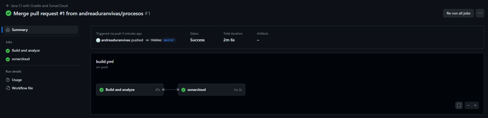
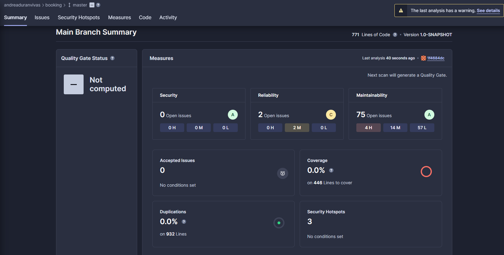
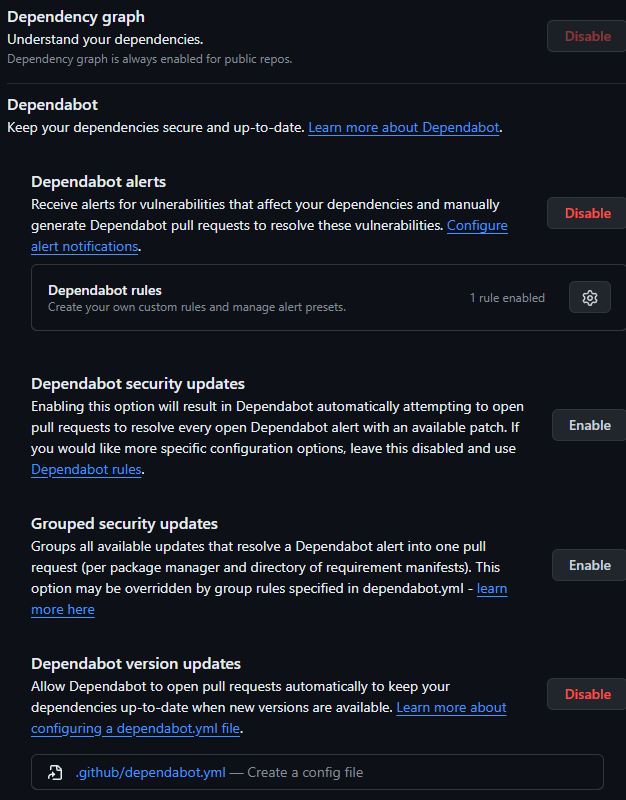
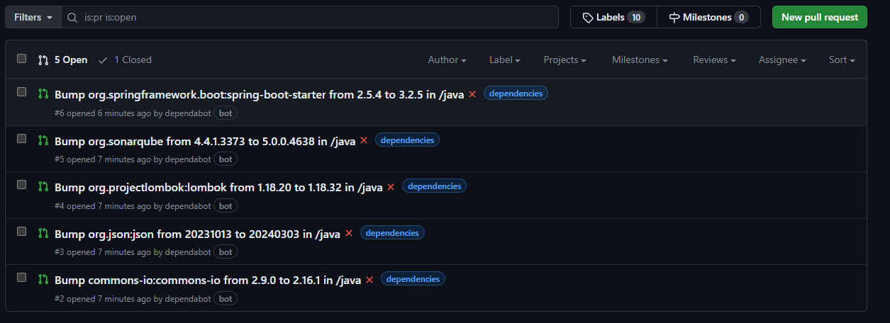

# Deuda Técnica en Procesos

Configuramos un proceso de CI utilizando GitHub Actions con los pasos de Build, Unit Test y Code Analysis reportando en SonarCloud para un proyecto Gradle.
Este flujo de trabajo se activará en eventos de push y pull request en la rama principal.

## Archivo build.yml

Primero, crea un archivo `.github/workflows/build.yml` en la raíz del repositorio con el siguiente contenido:

```yaml
name: Java CI with Gradle and SonarCloud

on:
  push:
    branches:
      - master
      - procesos
  pull_request:
    types: [opened, synchronize, reopened]

jobs:
  build:
    name: Build and analyze
    runs-on: ubuntu-latest

    steps:
      - uses: actions/checkout@v3
        with:
          fetch-depth: 0

      - name: Set up JDK 17
        uses: actions/setup-java@v3
        with:
          java-version: '17'
          distribution: 'zulu'

      - name: Setup Gradle
        uses: gradle/gradle-build-action@v2
        with:
          gradle-version: 7.4

      - name: Build with Gradle
        run: ./gradlew build
        working-directory: java

      - name: Run Unit Tests
        run: ./gradlew test
        working-directory: java

  sonarcloud:
    needs: build
    runs-on: ubuntu-latest

    steps:
      - uses: actions/checkout@v3

      - name: Set up JDK 17
        uses: actions/setup-java@v3
        with:
          java-version: '17'
          distribution: 'zulu'

      - name: Setup Gradle
        uses: gradle/gradle-build-action@v2
        with:
          gradle-version: 7.4

      - name: Cache SonarCloud packages
        uses: actions/cache@v3
        with:
          path: ~/.sonar/cache
          key: ${{ runner.os }}-sonar
          restore-keys: ${{ runner.os }}-sonar

      - name: Cache Gradle packages
        uses: actions/cache@v3
        with:
          path: ~/.gradle/caches
          key: ${{ runner.os }}-gradle-${{ hashFiles('**/*.gradle') }}
          restore-keys: ${{ runner.os }}-gradle

      - name: Build and analyze
        env:
          GITHUB_TOKEN: ${{ secrets.GITHUB_TOKEN }}
          SONAR_TOKEN: ${{ secrets.SONAR_TOKEN }}
        run: ./gradlew build sonar --info
        working-directory: java
```

Este flujo de trabajo se divide en dos trabajos principales:

1. **Build y Unit Tests:** Este trabajo se encarga de compilar el proyecto con Gradle y ejecutar las pruebas unitarias.
2. **SonarCloud:** Este trabajo depende del trabajo anterior y se encarga de realizar el análisis de código con SonarCloud. 
Para ello, utiliza la acción jinguji/sonarcloud-gradle-github-action@v2, que se encarga de ejecutar el análisis de código y reportar los resultados a SonarCloud.


Para que este flujo de trabajo funcione correctamente, configuramos las siguientes variables de entorno en los secretos de tu repositorio de GitHub:

- **SONAR_TOKEN:** El token de acceso para SonarCloud.
- **GITHUB_TOKEN:** El token de acceso para GitHub, que es necesario para que la acción de SonarCloud pueda interactuar con GitHub.

Este sería el resultado del flujo de trabajo en GitHub Actions:




Y este sería el resultado del análisis de código en SonarCloud:



---
## Step Adicional: Code Security and Analysis

Para mejorar la seguridad del código y detectar posibles vulnerabilidades, podemos integrar herramientas de análisis estático de código en nuestro flujo de trabajo.
En este caso, habilitamos las opciones `Dependency graph`, `Dependabot alerts` y `Dependabot version updates` en GitHub para recibir alertas sobre vulnerabilidades en las dependencias del proyecto.



Además, configuramos `dependabot.yml` para que revise las dependencias del proyecto, notifique y actualice las actualizaciones disponibles.

```yaml
version: 2
updates:
- package-ecosystem: "gradle"
  directory: "/java"
  schedule:
  interval: "weekly"
```

Este es el resultado del análisis de dependencias y actualizaciones en GitHub (Automatiza las actualizaciones de dependencias haciendo PRs):



Finalmente, integramos las alertas sugeridas al trabajo, haciendo un merge de los Pull Requests generados por Dependabot.